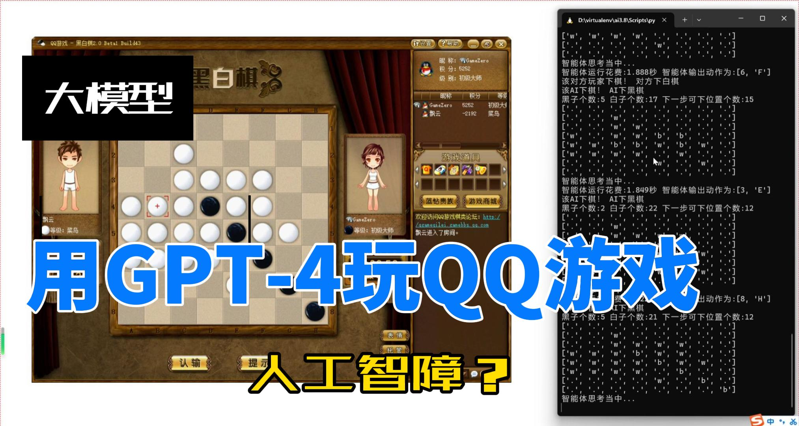
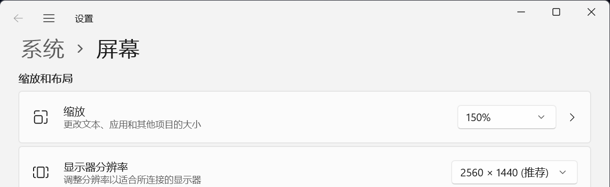

# LLM4Reversi

[知乎](https://zhuanlan.zhihu.com/p/668878505) | [Bilibili](https://www.bilibili.com/video/BV1cC4y1y7HC/?share_source=copy_web&vd_source=5bb664bc37bc759feac3229a09927319)

## 安装

```commandline
pip install -e .
```

### 设置GPT-4 API的调用网址和秘钥

在`reversi_tool/agents/config/gpt4.json`中设置`api_base`和`api_key`。

## 本地下棋

<div align="center">
  </a>
</div>

在终端中执行如下命令即可启动：
```commandline
cd web
python run.py
```

然后用浏览器打开 http://localhost:2333 即可。

## 使用大模型玩QQ游戏

<div align="center">
    <a href="https://zhuanlan.zhihu.com/p/668878505"></a>
</div>

### 电脑配置要求

电脑需要时是Windows系统，需要安装QQ游戏大厅。
电脑屏幕分辨率需要设置为2560x1440，缩放大小为150%。具体设置如下图所示：
<div align="center">
    
</div>

### 执行命令

```commandline
cd qq_game
python run.py
``` 

## 下棋机制介绍

### 输入规则

黑白棋中，棋盘大小为8x8，黑棋先走。
我们程序中，黑子在棋盘上表示为1，白子在棋盘上表示为-1，空位表示为0。棋盘输入为一个64维的数组。

### 动作输出

返回一个0到63的整数，表示下棋的位置。下棋位置顺序为从左到右，从上到下。左上角为0，右上角为7，左下角为56，右下角为63：

```text
0  1  2  3  4  5  6  7
8  9  10 11 12 13 14 15
16 17 18 19 20 21 22 23
24 25 26 27 28 29 30 31
32 33 34 35 36 37 38 39
40 41 42 43 44 45 46 47
48 49 50 51 52 53 54 55
56 57 58 59 60 61 62 63
```

## 贡献者

- [x] [黄世宇](https://huangshiyu13.github.io/)
- [x] [陈俊哲](https://github.com/chenjz20Thu)
